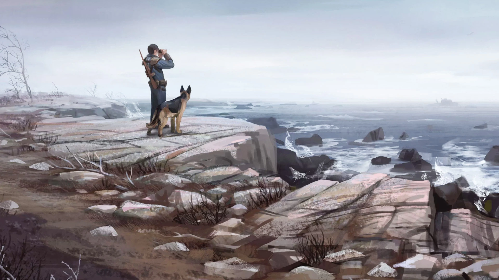

# Tales from the Northern Lands

A preliminary Readme which will be rewritten if/when this list becomes official

This is a wabbajack list for Fallout 4 that aims to shape the gameplay into a unique direction, one of solitude and atmosphere, and gritty immersion.

Id say I was inspired by Ultimate Skyrim for Skyrim LE and Serenity for Skyrim SE.
Immersion and realism, are kinda dirty words in modding these days, but I still like them.

It is based upon the excellent Welcome to Paradise by Phoenix, but uses only the graphics and bugfixes sections of that list really, the rest is custom.

First and foremost - PLEASE READ THIS IF NOTHING ELSE: I have HEAVILY modified many many mods in this list, so they often look nothing like what they started out as.
For this reason please do NOT go to the original authors on Nexusmods for support if something seems wrong, come to me on the wabbajack Discord, or log an issue on this github.

For example - for many of the weapon mods I have removed the scripted leveled list injections and remade leveled lists by hand, and stoped them being hand-placed in the world, if you read the original mods description you may be expecting something to appear ingame, that would not in this list.  If you go to the original mod author saying something is wrong you will either make them angry or be laughed at.

QUICKSTART.

If you dont want to read all this crap, just do this bit to install the list.

After wabbajack has finished, copy the CONTENTS of the "Game Folder Files" folder in the list install directory, into your Fallout 4 steam directory.
After starting the game, you will go straight from the Bathroom scene where you create your character , and then pick your stats, then teleport to the vault exit sequence, after this, open the mod config menu, select the very first entry there on the top which is "MCM settings manager" and then click apply on the preset that is displayed there.
Thats it, your done.

Right now thats out of the way lets list some of the changes.

There is no settlement building, thats right - none.
No babysitting settlements, no rebuilding civilization, Preston and the minutemen and the sanctuary crew are all deleted from the game, gone, kaput.

( From a combined and modified mash-up of Last Man Standing, and Minutemens Last Stand mods )

In this list, a "settlement" like Sanctuary is now a semi-permanent camp where the player can treat their wounds and craft items and sleep in a slightly safer place.

They cannot become leader of existing settlements, they can only create new semi-permanent camps by taking over abandoned settlements.

If they ally with an existing settlement, they can then camp there and benefit from its safety. ( more on this later ) and get merchant discounts, thats it.

( or you could kill all NPCs at a settlement and take it over as a new camp ! )

This is a list based around Survival mode, and extends many of its features.
For example:

You can now get wounds such as bleeding, open wounds, burns and pain. and need specific items to cure these wounds; such as bandages, surgery kits, booze ( for pain ) etc.
( modified versions of Better Locational Damage, Agony, and Survival First Aid combined all patched to work together ).

Sleeping only heals you up to a certain cap. 

Food does not heal, nor does water.

Crafting and building does not give any XP

Radiation is now far more prevalent in hot pockets dotted around the landscape, and is far more damaging, and amplified in food and water.
Choosing equipment with radiation protection over physical protection is now a very real choice.
In vanilla F4 radiation was hardly ever a concern, now it is.

Armor now has encumbrance values based on its weight, which slows down the player speed and reduces action points, making lighter armor a more viable option later into the game.

Crafting items from workbenches now passes time so that your hunger and thirst and sleep are a currency of sorts, this also applies to the limited settlement building allowed ( mostly workbenches ) and settlement scrapping too.

There is a Simplistic mental health/PTSD system in place, where the more humans you kill, the more your already stressed mind suffers ( hey you lost your partner and kid and the world has ended, and you are already a veteran ( well the male player is ), so some artistic license to suggest the player is already susceptible to this ).
The effects of this system can be alleviated by petting dogmeat, taking chems, and smoking.

Smoking and sleeping will save the game.

Better Locational Damager makes headshots matter.

Technical Documents are now useful for legendary upgrades.

When you die you respawn at the bed you last slept at , with caps and SPECIAL and xp penalties ( and whatever agony/first aid wounds you had when you died)
this disincentivizes save scumming, and makes survival less frustrating at the same time.

Perks and Tag skills are added by the "You're Special" mod to add variety to builds.

Loot is handled by modified "Damn Apocalypse" mod which mostly overwrites BLDs leveled lists, makes found loot and food scarce in the commonwealth.

Hunter of the commonwealth mod is used to add alternative sources for food and leather for the nomadic playstyle.

Alongside the Campsite mod, which allows you to sleep and cook and do simple crafting when you are out in the wilderness.

You cannot camp in the grounds of a faction/NPC settlement, until you are allied to them.

Alongside the Sleepness nights mod, which adds danger to sleeping in various places; as below

1. Interior cell that is cleared - Most safe
2. player-owned settlement or an NPC settlement that like you - moderately safe
3. interior cell that is not cleared - mildly dangerous
4. exterior campsite camp - pretty dangerous
5. random bed/mattress outside - very dangerous

More purified water recipes, craft empty bottles, get bottles back from drinking. More adhesive recipes.
Around 180 added guns of various types, some of which are craftable.
Around 600 new armor and clothing pieces, many of which are craftable.
Many new ammo calibers that are also craftable, integrated into Weapons of Fate projectiles so they have realistic range and drop.
All of which hand placed into custom leveled lists that distribute them into the world appropiately.

You will not see the valuable pre-war guns before level 10 or so, and only the post-war scrap ones are craftable.
Most of the armor is craftable however, but gated behind later perks.

Chems and Alcohol now have appropiate visuals, along with low health effects.
Coffee
Tea
Fishing
Fast Travel handled by the excellent JOURNEY mod, by default fast travel is restricted to "fast travel to Settlements only, from anywhere"
Power Armor mods are the same as from Welcome to Paradise, with Consistent Power Armor Overhaul, Take your cores, restore power armor frames, and some assembly required.

You can pet dogs!

Dogmeat backpacks!

West-tek tactical optics!

No Power armor or minigun in Concord, because fuck you thats why.
No already-built crafting benches or power armor crafting bench in Sanctuary or Red Rocket, because fuck you thats why
Weapons are uniformly more expensive to purchase, especially prewar ones!
Bows
Crossbows

This is phase 1

Phase 2 is to add quests
Phase 3 is to look what can be achieved with Synthesis and DLL mods to make the gameplay even weirder.

## Credits and Thanks

- Xanza for knowledge
- Lively for knowledge
- Luca for knowledge
- Halgari for this playground we play in
- Baka for the framework that helped me get through some roadblocks
- Everyone else in the wabbajack team who make it a repository of knowledge, and also interesting times.
- the creator of ReShade with its generous [License](ReShade/RESHADELICENSE.md) that allows me to include it.
